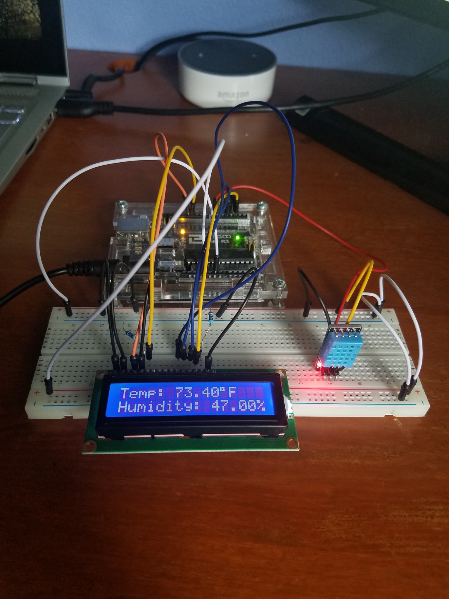

# Arduino DHT11 Temperature & Humidity Monitor

A simple Arduino Uno project that measures real-time temperature and humidity using a DHT11 sensor and displays the readings on a 16x2 LCD screen.

## Project Overview

This project uses:

- Arduino Uno
- DHT11 temperature and humidity sensor
- 16x2 LCD display
- Breadboard and jumper wires

The Arduino reads environmental data from the DHT11 sensor and outputs the values directly to the LCD display.

## Features

- Real-time temperature monitoring
- Real-time humidity monitoring
- LCD display output
- Beginner-friendly Arduino project
- Breadboard prototype design

## Hardware Used

| Component | Purpose |
|---|---|
| Arduino Uno | Main microcontroller |
| DHT11 Sensor | Measures humidity and temperature |
| 16x2 LCD Display | Displays sensor readings |
| Breadboard | Circuit prototyping |
| Jumper Wires | Component connections |

## DHT11 Specifications

| Specification | Value |
|---|---|
| Humidity Range | 20–90% RH |
| Humidity Accuracy | ±5% RH |
| Temperature Range | 0–50°C |
| Temperature Accuracy | ±2°C |
| Operating Voltage | 3V to 5.5V |

## Project Image



## Libraries Included

The repository includes the required Arduino libraries:

- `DHTLib.zip`
- `LiquidCrystal-1.0.7.zip`

To install them:

1. Open Arduino IDE
2. Go to Sketch → Include Library → Add .ZIP Library
3. Select each ZIP file

## How It Works

1. The DHT11 sensor measures ambient temperature and humidity.
2. The Arduino processes the sensor data.
3. The LCD updates in real time with the current readings.
4. Temperature is displayed in Fahrenheit.
5. Humidity is displayed as a percentage.

## Running the Project

1. Install the included libraries
2. Open `TempHumid.ino` in Arduino IDE
3. Connect the Arduino Uno
4. Select the correct board and COM port
5. Upload the sketch
6. Watch the LCD display update with live sensor readings

## Example Output

```text
Temp: 73.40°F
Humidity: 47.00%
```

## Future Improvements

- Add Celsius/Fahrenheit toggle
- Add data logging to SD card
- Add Wi-Fi or Bluetooth support
- Upload readings to a cloud dashboard
- Add high/low temperature alerts
- Create a custom enclosure

## Technologies Used

- Arduino C++
- DHT11 Sensor
- LiquidCrystal Library
- Embedded Systems
- Breadboard Prototyping
